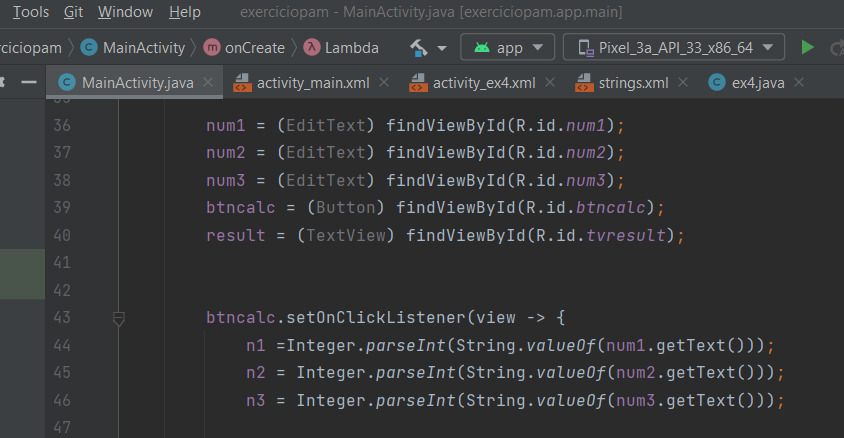

# Prints e explicações 
## Sobre o Git Bash e Exercícios no Android Studio

O android studio, como já sabemos, é uma plataforma para a criação de aplicações mobile, ou seja, para android. Enquanto isso, o GitHub é uma plataforma que possibilita o acesso, organização e implementação de arquivos em repositórios acessíveis. O github possui suas vertentes, dentre elas o controle de versão, que funciona por base de linha de comando. 

Abaixo as etapas e explicações sobre como "upar" arquivos em um repositório usando o git hub linha de comando: 
![git linha de código, print 1][def]

[def]: image.png


```
$Git init: Serve para iniciar o repositório para onde os arquivos do repositório vão;
$Git add remote origin: Serve para configurar o repositório, o associando ao endereço do servidor
$Git Pull: Recupera os arquivos do servidor (se existentes) e as mescla.
```
Da para observar na imagem acima alguns erros possíveis. Neste caso, é importante ler e ver o que estava sendo pedido. Eram alguns pequenos erros de sintax, que é importante a ser observado. 

![Print de continuação da imagem 1][def2]

[def2]: image-1.png

Efetuamos o Git pull novamente, desta vez trocando a branch de master para main, que era o possível erro. Uma branch é a ramificação de código na qual se está escrevendo. 

![Continuação dos prints][def3]

[def3]: image-2.png

![Continuação dos Prints][def4]

[def4]: image-3.png

```
$git add . : Adiciona os arquivos selecionados ao repositório configurado
```

Os arquivos "upados" dentro do repositório se tratam de exercícios de fixação no Android Studio, vejamos: 

![Print exercicio 5][def5]



[def5]: image-4.png

![Continuação dos prints do exercicio 5][def6]

[def6]: image-6.png

![Continuação dos prints do exercicio 5][def7]

[def7]: image-7.png

Na primeira imagem há a declaração das váriaveis e dos elementos. Em seguida a conexão dos elementos e conversão das váriaveis para os cálculos então, estruturas condicionais onde alguma das variveis pode receber um número negativo para desconsiderar ela e calcular a soma apenas das variaveis que receberam valores positivos.
Por fim, os códigos do botão para enviar para o outro exercicio (o **getBaseContext** foi usado como substituto do **this** porque o android não quis reconhecer).

Agora vejamos o exercício 4: 

![Prints do exercicio 4][def8]

[def8]: image-8.png

![Continuação dos prints do exercicio 4][def9]

[def9]: image-9.png

![Continuação dos prints do exercicio 4][def10]

[def10]: image-10.png

Na primeira etapa pode ser observado o mesmo do que foi feito no exercício anterior. Já na segunda etapa há uma condição para garantir que foi informado um horario entree 24-0, outra para horarios até 17 que ao receber 6 horas ainda não passa da meia noite onde o horario reseta  e as últimas condições para os valores que ultrapassam a meia noite e devem ser contados como 1, 2, 3... e não como 25, 26, 27 como aconteceria caso só somasse 6 horas. Por último, a terceira etapa é apenas o código do botão, utilizando a mesma sintaxe do anterior.

Nas Views foram usados apenas elementos simples, sendo eles: 

```
Tipos de elemento TextView: 
EditText: Caixa de texto editável, sendo de letras ou números, dependendo do que for definido em seu código Java
Text View: Caixa de texto visual, um elemento apenas para ser visto/mostrado na tela.

Tipo de elemento Button:
Button: Usado para realizar uma ação de clique, sendo ela mostrar algum resultado e ou passar para a próxima tela.
```